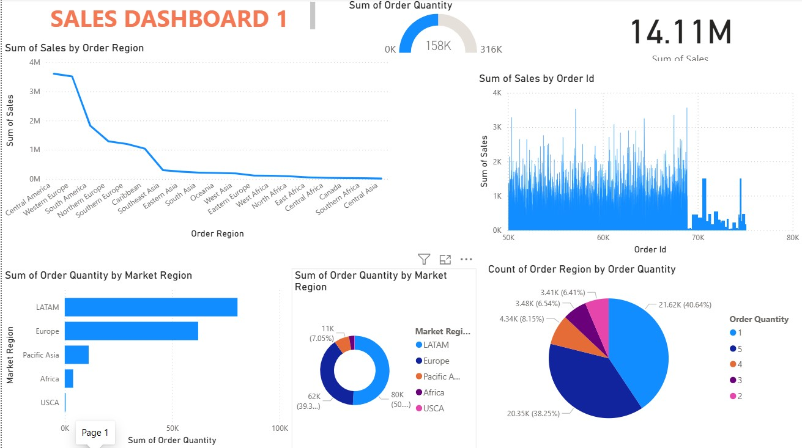
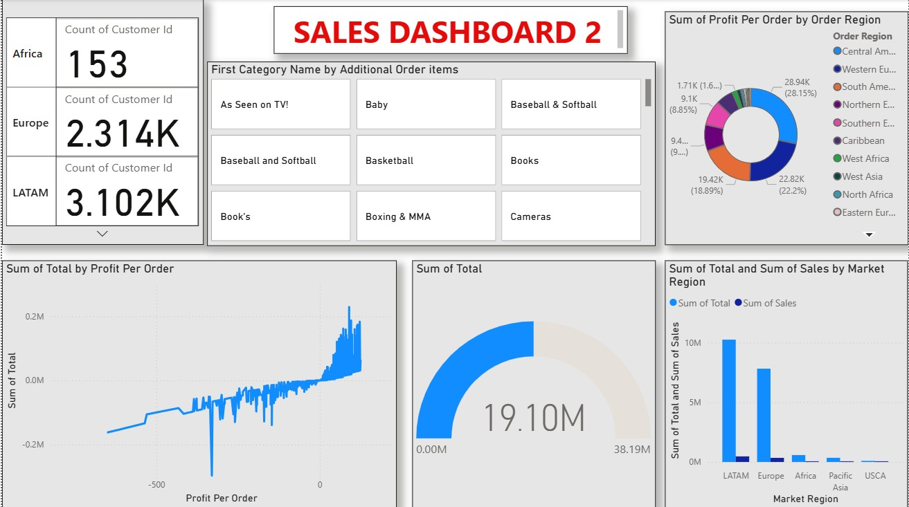

# Global Sales Analytics Dashboard | Power BI Project

## Overview
This project is an interactive Global Sales Analytics Dashboard developed using Power BI to analyze worldwide sales performance, customer distribution, market regions, order quantities, and profit trends. 

The project consists of two interconnected dashboards created using a single dataset to provide comprehensive business insights through advanced visualizations and KPI analysis.

## Dashboard Modules

### Sales Dashboard 1
Focused on:
- Sales analysis by order region
- Order quantity tracking
- Market region performance
- Sales distribution analysis
- Regional order insights

### Sales Dashboard 2
Focused on:
- Profit analysis by region
- Customer distribution
- Product category insights
- Market-wise sales comparison
- Profit per order analysis

## Key Features
- Interactive Power BI dashboards
- Region-wise sales and profit analysis
- KPI monitoring and business reporting
- Market performance comparison
- Customer and order analysis
- Dynamic visualizations using a shared dataset

## Visualizations Included
- KPI Cards
- Line Charts
- Pie Charts
- Donut Charts
- Gauge Charts
- Bar Charts
- Interactive Filters & Slicers

## Tools & Technologies
- Power BI
- Excel / CSV Dataset
- Data Visualization
- Business Intelligence
- Data Analysis

## Business Insights
- LATAM and Europe generated the highest order quantities and sales
- Regional sales performance varied significantly across global markets
- Profit trends highlighted high-performing and low-performing regions
- Customer distribution analysis provided valuable market insights
- Product category analysis helped identify business opportunities

## Dashboard Preview

### Dashboard 1



### Dashboard 2



## Repository Structure

```bash
global-sales-dashboard/
│
├── GlobalSalesDashboard.pbix
├── dashboard1.png
├── dashboard2.png
├── sales_data.csv
└── README.md
```

## Learning Outcomes
This project demonstrates practical skills in:
- Power BI Dashboard Development
- Data Visualization
- KPI Reporting
- Business Intelligence Analytics
- Sales & Profit Analysis
- Interactive Report Design

## Project Purpose
The purpose of this project is to transform raw global sales data into meaningful business insights through interactive dashboards and visual storytelling.

## Career Relevance
This project is suitable for showcasing skills related to:
- Data Analyst Roles
- Power BI Developer Roles
- Business Analyst Roles
- Business Intelligence Positions
